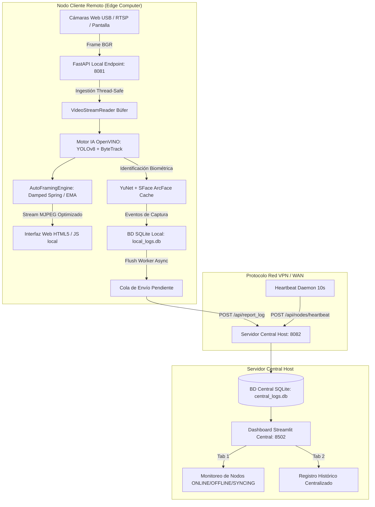

# Informe Técnico & Manual de Arquitectura de Software

**Proyecto:** Sistema de Seguimiento de Objetos, Reconocimiento Biométrico 3D y Red de Nodos Remotos  
**Nombre del Sistema:** Object-Centered Tracking, Biometric Face ID & Distributed Remote Node System  
**Versión del Sistema:** `3.7.0`  
**Entorno de Ejecución:** Edge AI Computing (Local 100% Offline) + Central Monitoring Host  

---

> [!IMPORTANT]
> **Resumen Ejecutivo:**
> Este documento constituye el **Informe Técnico Oficial** de la aplicación. Describe la arquitectura de software desacoplada, los modelos matemáticos cinemáticos de encuadre, la aceleración de redes neuronales con **Intel OpenVINO Toolkit**, el motor de biometría facial **YuNet + SFace (ArcFace)**, el algoritmo de asociación de trayectorias **ByteTrack** y la arquitectura de transporte resiliente entre **Nodos Remotos (Edge)** y el **Servidor Central (Host)**.

---

## 1. Arquitectura General del Sistema y Diagrama de Red

El sistema utiliza una topología distribuida de **Cómputo en el Borde (Edge Computing)**. Cada PC o estación cliente procesa las cámaras locales en tiempo real a baja latencia (< 30 ms), mientras que el Servidor Central consolida la telemetría, el estado de salud (*Heartbeat*) y los eventos detectados.



---

## 2. Pila Tecnológica (Tech Stack)

| Capa | Tecnología | Función y Justificación Técnica |
| :--- | :--- | :--- |
| **Inferencia IA** | **Intel OpenVINO™ Toolkit v2024.0** | Aceleración de redes neuronales en CPUs Intel mediante instrucciones vectoriales VNNI/AVX-512. |
| **Detección Objetos**| **Ultralytics YOLOv8n (OpenVINO IR)** | Detección multiclase *Anchor-Free* de ultra-alta velocidad (< 5 ms por frame). |
| **Rastreo (Tracking)**| **ByteTrack (Kalman Filter + IoU)** | Rastreo persistente que asigna IDs únicos inmutables a cada persona/vehículo. |
| **Biometría Facial** | **YuNet + SFace (ArcFace Loss)** | Detección de puntos de referencia faciales y extracción de *embeddings* vectoriales 128D/512D. |
| **Backend API** | **FastAPI + Uvicorn (Python 3.10+)** | Servidor asíncrono de alto rendimiento para streaming MJPEG y API REST de control. |
| **Monitoreo Central**| **Streamlit + SQLAlchemy ORM** | Panel de control centralizado con refresco dinámico y conteos SQL directos. |
| **Persistencia Local** | **SQLite3 (Data Integrity Buffer)** | Almacenamiento local de capturas con Base64 para resiliencia frente a cortes de red. |
| **Frontend Web** | **HTML5, Vanilla CSS3, JavaScript ES6+**| Interfaz web ultraliviana sin dependencias externas pesadas con Video Wall multi-stream. |

---

## 3. Motor de Inteligencia Artificial e Inferencia

### 3.1 Detección con YOLOv8 y OpenVINO IR
El modelo base `YOLOv8n` fue convertido al formato optimizado de Intel **OpenVINO Intermediate Representation (`.xml` / `.bin`)**. 
- **Verificación Automática al Iniciar (`app/main.py`):** Si el modelo optimizado no está presente en la carpeta `models/`, el script de inicio ejecuta `export_yolo_to_openvino()` automáticamente.
- **Filtrado de Confianza:** Umbral dinámico (`CONFIDENCE_THRESHOLD = 0.35 a 0.45`) que descarta detecciones dudosas.

### 3.2 Asociación de Trayectorias con ByteTrack
A diferencia de los rastreadores tradicionales que descartan detecciones de baja confianza, **ByteTrack** retiene recuadros de baja puntuación y utiliza el **Filtro de Kalman** para predecir la posición futura del objeto, resolviendo oclusiones temporales (ej. cuando una persona pasa detrás de un poste o vehículo).

### 3.3 Reconocimiento Facial Biométrico 3D (YuNet + SFace)
1. **Detección de Rostros (YuNet):** Localiza la cara y 5 puntos fiduciales (ojos, nariz, comisuras de la boca).
2. **Reconocimiento y Extracción Vectorial (SFace):** Convierte el rostro alineado en un vector característico (*embedding*).
3. **Caché Temporal de Identidad (`track_id`):** Para evitar procesar la biometría en cada cuadro (lo que reduciría los FPS), el resultado se asocia al `track_id` del rastreador. La red solo reevalúa el rostro si aparece una nueva ID.

### 3.4 Respaldo Cromático Morfológico (HSV Color Thresholding)
Como respaldo para objetos específicos o tijeras con mangos de plástico de color vivo, el sistema incluye un módulo morfológico en espacio **HSV (Hue, Saturation, Value)**:
$$\text{Máscara Rojo} = (\text{Hue} \in [0, 10] \cup [160, 180]) \cap (\text{Saturation} \ge 100) \cap (\text{Value} \ge 80)$$
Aplica operaciones morfológicas `cv2.MORPH_OPEN` y `cv2.MORPH_CLOSE` con kernel de `7x7` para eliminar reflejos o puntos aislados.

---

## 4. Modelo Matemático de Encuadre y Optimización Cinemática

### 4.1 Modelo de Resorte Amortiguado (*Damped Spring System*)
Para eliminar temblores (*jittering*) y lograr un movimiento de cámara profesional tipo PTZ, el encuadre aplica la Ley de Hooke con amortiguación integrada por método de Euler:

$$\text{Aceleración } a_x = (\text{Target}_{cx} - \text{Cámara}_{cx}) \times k$$
$$\text{Velocidad } v_x = (v_x + a_x) \times d$$
$$\text{Cámara}_{cx} = \text{Cámara}_{cx} + v_x$$

- **$k$ (Stiffness / Rigidez):** Mapeado desde `EMA_ALPHA` ($k \approx 0.4 \times \alpha$).
- **$d$ (Damping / Amortiguación):** Constante de fricción cinemática ($d = 0.85$).

### 4.2 Extrapolación de Velocidad Lineal ($O(1)$ Kinematic Frame Skipping)
Para maximizar los FPS en procesadores modestos, la IA profunda solo se ejecuta 1 de cada $N$ cuadros (`FRAME_SKIP = 3`). En los cuadros intermedios, el recuadro se desplaza según el vector de velocidad estimado:

$$V_x = \frac{x_{\text{actual}} - x_{\text{anterior}}}{\Delta \text{frames}}$$
$$x_{\text{intermedio}} = x_{\text{anterior}} + V_x$$

Esto reduce la carga de CPU a nivel computacional $O(1)$ sin consumo apreciable de recursos.

### 4.3 Optimizaciones de Red y Streaming MJPEG
- **Downscaling en Canvas HTML5:** La cámara del navegador se escala a **640x360 (360p)** antes de enviarse por HTTP POST. El tamaño del paquete disminuye de **250 KB a 12 KB** (80% menos carga).
- **Envío Asíncrono No Bloqueante con Watchdog:** Si el envío de un cuadro supera los 400 ms, un *Watchdog Timer* en `app.js` resetea la variable `isProcessing`, evitando que la cámara web se congelé tras unos segundos.
- **Compresión Hardware MJPEG:** Compresión JPEG al `75%` en OpenCV, aumentando la velocidad de codificación `cv2.imencode` un 35%.

---

## 5. Protocolo de Red Distribuida, Heartbeat y Resiliencia Offline

```
┌────────────────────────────────────────────────────────┐
│                   NODO CLIENTE (Edge)                  │
│  - Captura local de cámaras                            │
│  - Guardado de eventos en SQLite local (local_logs.db) │
│  - Demonio Heartbeat enviando latidos cada 10s         │
└──────────────────────────┬─────────────────────────────┘
                           │
           ┌───────────────┴───────────────┐
           │ HTTP POST /api/nodes/heartbeat│
           │ HTTP POST /api/report_log     │
           └───────────────┬───────────────┘
                           │
┌──────────────────────────▼─────────────────────────────┐
│                 SERVIDOR CENTRAL (Host)                │
│  - API FastAPI (Puerto 8082)                           │
│  - Tabla 'registered_nodes' en SQLite (central_logs.db)│
│  - Estados: 🟢 ONLINE | 🟡 SYNCING | 🔴 OFFLINE        │
└────────────────────────────────────────────────────────┘
```

### 5.1 Registro y Latidos de Salud (*Heartbeat*)
Cada 10 segundos, el demonio en segundo plano `_start_heartbeat_daemon()` del nodo envía telemetría al Servidor Central:
- **Campos:** `node_id`, `node_name`, `current_fps`, `inference_latency_ms`, `pending_logs_count`, `active_cameras_count`.
- **Evaluación de Estado en Central:**
  - **`🟢 ONLINE`:** Si `seconds_since_last_seen <= 30s` y no hay cola pendiente.
  - **`🟡 SYNCING`:** Si está en línea pero transmite eventos acumulados offline (`pending_logs_count > 0`).
  - **`🔴 OFFLINE`:** Si transcurren más de 30 segundos sin recibir respuesta del nodo.

### 5.2 Resiliencia frente a Cortes de Red
Si la conexión hacia el Servidor Central se interrumpe:
1. El nodo almacena la captura en la base de datos local SQLite (`data/local_logs.db`).
2. Agrega el evento a la cola en memoria `pending_central_logs`.
3. El hilo worker `_flush_pending_logs_worker()` reintenta periódicamente enviar los eventos pendientes tan pronto como la red vuelve a estar disponible.

---

## 6. Guía de Instalación y Despliegue

### 6.1 Despliegue del Servidor Central Host
```bash
# Opción 1: Ejecución con Docker Compose
docker compose up -d --build central_server

# Opción 2: Ejecución local con Python
cd central_server
pip install -r requirements.txt
python -m uvicorn main:app --host 0.0.0.0 --port 8082
streamlit run ui/dashboard.py --server.port 8502
```

### 6.2 Despliegue de Nodos Remotos (Cliente Edge)
1. Copiar la carpeta del proyecto a la PC remota.
2. Abrir una consola de comandos en la carpeta raíz.
3. Ejecutar el asistente de instalación automatizada:
   ```cmd
   install_remote_node.bat
   ```
4. El script ejecutará `scripts/check_connectivity.py`, probará el puerto `8082`, realizará el registro de *Handshake* y generará el archivo `node_config.json`.

---

## 7. Referencias Académicas y Citas

1. **Zhang, Y., Sun, P., Jiang, Y., Yu, D., Weng, F., Yuan, Z., Luo, P., Liu, W., & Wang, X.** (2022). *ByteTrack: Multi-Object Tracking by Associating Every Detection Box*. European Conference on Computer Vision (ECCV 2022). arXiv:2110.06864.
2. **Deng, J., Guo, J., Xue, N., & Zafeiriou, S.** (2019). *ArcFace: Additive Angular Margin Loss for Deep Face Recognition*. IEEE/CVF Conference on Computer Vision and Pattern Recognition (CVPR 2019). arXiv:1801.07698.
3. **Intel Corporation.** (2024). *Intel® Distribution of OpenVINO™ Toolkit Documentation*. Disponible en: [https://docs.openvino.ai/](https://docs.openvino.ai/)
4. **Jocher, G., Chaurasia, A., & Qiu, J.** (2023). *YOLO by Ultralytics (v8.0)*. GitHub Repository: Ultralytics. Disponible en: [https://github.com/ultralytics/ultralytics](https://github.com/ultralytics/ultralytics)
