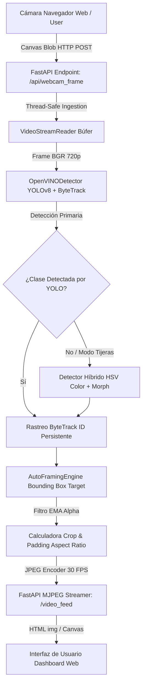

# Arquitectura del Sistema y Ciclo de Reconocimiento de Objetos

Este documento detalla en profundidad la arquitectura técnica del sistema **Object-Centered Tracking & Auto-Framing**, el funcionamiento de los motores de Inteligencia Artificial y el ciclo de vida completo de un fotograma desde que entra por la cámara web hasta que se presenta reencuadrado en la interfaz.

---

## 1. Arquitectura General del Sistema

El sistema utiliza una arquitectura desacoplada cliente-servidor con aceleración de hardware local (CPU Intel con VNNI/AVX-512 o iGPU) mediante **Intel OpenVINO Toolkit**.

---

## 2. Ciclo de Vida de un Fotograma (Paso a Paso)

El flujo de procesamiento ocurre en tiempo real a **~30 FPS con una latencia < 35 ms**:

### Paso 1: Captura en el Cliente (Frontend `app.js`)
1. El navegador captura la cámara con `navigator.mediaDevices.getUserMedia`.
2. Cada ~30 ms, dibuja el fotograma actual en un `<canvas>` oculto (`webcamCanvas`).
3. Convierte la imagen a un Blob comprimido JPEG mediante `canvas.toBlob(...)`.
4. Envía la imagen al servidor vía HTTP POST multipart a `/api/webcam_frame`.

### Paso 2: Recepción e Inyección Búfer (Backend `routes.py` y `video_stream.py`)
1. El endpoint asíncrono `/api/webcam_frame` recibe el archivo subido.
2. Decodifica la matriz JPEG a una matriz numérico-matemática OpenCV `BGR` de 3 canales mediante `cv2.imdecode(...)`.
3. Almacena el fotograma en `VideoStreamReader.push_frame()`, el cual notifica al pipeline que la cámara web está activa.

### Paso 3: Inferencia IA con Intel OpenVINO (`detector.py`)
1. **Model Run (YOLOv8 OpenVINO IR)**: El fotograma en formato de matriz se pasa a la red neuronal `YOLOv8n` exportada a formato OpenVINO (`.xml` / `.bin`).
2. **Extracción de Bounding Boxes**: La red analiza patrones cromáticos, bordes y texturas en la imagen y retorna las cajas delimitadoras `[x1, y1, x2, y2]`, el ID de clase COCO (ej: `0` para persona, `76` para tijeras, `67` para celular) y la probabilidad de confianza (Confidence score `0.0` a `1.0`).
3. **Filtro de Confianza (`CONFIDENCE_THRESHOLD = 0.45`)**: Solo las detecciones con un 45% o más de certeza pasan la validación.

### Paso 4: Rastreo ByteTrack (`ByteTrack`)
1. Asigna un `track_id` único a cada objeto (ej. `ID #760`, `ID #868`).
2. Mantiene la identidad del objeto cuadro a cuadro mediante filtro de Kalman e intersección sobre unión (IoU), evitando que la cámara "salte" o pierda al sujeto si este se mueve rápido.

### Paso 5: Módulo Híbrido por Color HSV (Respaldo para Tijeras)
*¿Por qué existe este módulo?* La red YOLO estándar fue entrenada con el dataset público COCO, donde las tijeras suelen ser tijeras metálicas de oficina pequeñas. Para reconocer tijeras manuales con mango de plástico rojo vivo desde cualquier ángulo o con poca iluminación, incluimos una regla cromática:
1. Convierte el espacio de color de BGR a **HSV** (Hue, Saturation, Value / Tono, Saturación, Valor).
2. Aplica una máscara matemática que busca únicamente píxeles con **Rojo Puro e Intenso** (`Hue`: `0-10` y `160-180`, `Saturation >= 100`, `Value >= 80`).
3. **Filtrado Morfológico**: Elimina pequeños puntos aislados o sombras suaves mediante operaciones morfológicas `cv2.MORPH_OPEN` y `cv2.MORPH_CLOSE`.
4. Si encuentra un contorno rojo continuo mayor a `2.500px`, agrupa todos sus puntos y genera un recuadro unificado `red_scissors`.

### Paso 6: Motor de Auto-Framing y Suavizado EMA (`auto_framing.py`)
1. **Selección del Objeto Objetivo**: Identifica el objeto activo (o el más cercano al centro de la cámara).
2. **Padding y Aspect Ratio**: Añade un margen de seguridad (ej. 20%) alrededor del objeto y ajusta las proporciones del recuadro a la relación de aspecto elegida (`16:9`, `9:16`, `1:1`).
3. **Filtro EMA (Exponential Moving Average)**: Para evitar movimientos bruscos o temblores de la cámara, aplica un suavizado matemático a las coordenadas `(X, Y, W, H)`:
   $$\text{Posición}_{nue} = \alpha \cdot \text{Posición}_{actual} + (1 - \alpha) \cdot \text{Posición}_{anterior}$$
   *(donde $\alpha = 0.15$ es el factor de suavizado configurado en el panel).*

### Paso 7: Streaming MJPEG al Navegador
1. El fotograma final (recortado en modo `framed` o anotado en modo `annotated`) se codifica a JPEG a 85% de calidad.
2. Se transmite a la web a través del endpoint de streaming MJPEG `/video_feed`.

---

## 3. ¿Cómo Identifica la IA un Objeto vs. Otro?

### Deep Learning (YOLOv8)
La Inteligencia Artificial no mira el color aislado de las cosas; analiza **características visuales jerárquicas**:
- **Bordes y esquinas**: Curvas de las manos, forma del cuerpo, contorno metálico.
- **Textura y contexto**: Reconoce que dos brazos y una cabeza corresponden a una `Persona`, o que una pantalla plana negra corresponde a un `Celular`.

### Respaldo Cromático (HSV Color Thresholding)
- El espacio de color HSV separa el **color puro (Hue)** de la **iluminación (Value)**.
- **¿Por qué a veces puede confundirse con tijeras si hay una sombra o reflejo similar?**
  Si una superficie refleja luz roja intensa (como una franela roja, un estuche rojo o un reflejo brillante sobre una madera barnizada) y la luz crea una forma alargada, el algoritmo cromático puede ver un contorno continuo de color rojo y asumir que es la tijera.
  Por esta razón, ajustamos la saturación mínima a `100` y el área mínima a `2500px`, logrando que solo objetos rojos grandes e intensos sostenidos a corta distancia activen el respaldo.

---

## 4. Resumen de la Configuración en Tiempo Real

| Parámetro | Valor Actual | Descripción / Función |
| :--- | :--- | :--- |
| **Modelo Base** | YOLOv8n (OpenVINO IR) | Modelo optimizado de detección de objetos en tiempo real |
| **Umbral Confianza** | `0.45` (45%) | Mínima certeza requerida para aceptar una detección |
| **Rastreador** | ByteTrack | Asignación de ID único y seguimiento suave de objetos |
| **Sensibilidad Rojo** | `H: 0-10 / 160-180, S>=100, V>=80` | Máscara estricta para plásticos de tijera roja |
| **Filtro Morfológico** | Kernel `7x7`, Área `> 2500px` | Eliminación de ruido y reflejos pequeños del fondo |
| **Suavizado Cámara** | EMA ($\alpha = 0.15$) | Evita temblores cinemáticos en el encuadre |
